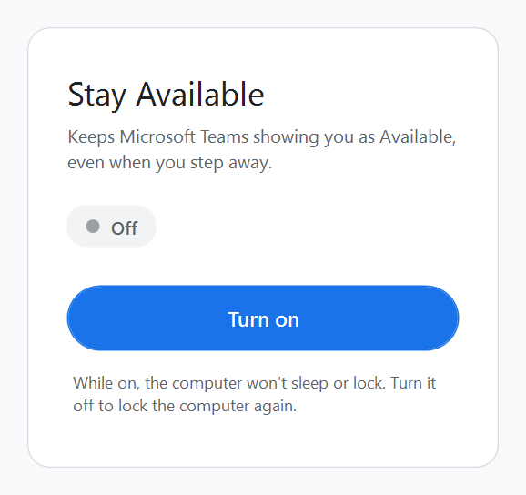
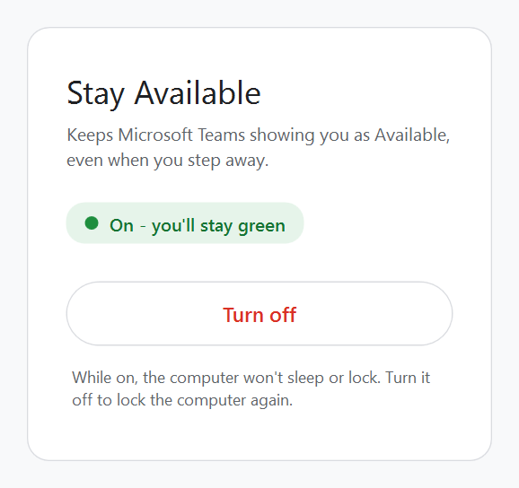

# Stay Available

A tiny Windows app that keeps Microsoft Teams showing you as Available (green), even when you step away from the computer.

Tested on Windows with Teams. If something doesn't work for you, please open an issue.

  
  

## How to use

1. Download `Stay-Available.bat` from the [latest release](../../releases/latest).
2. Double-click it. A small window opens.
3. Click **Turn on**. The status changes to "On - you'll stay green".
4. Click **Turn off**, or just close the window, to go back to normal.

The first time you run it, Windows may show a blue "Windows protected your PC" box. Click **More info** and then **Run anyway**.

## What it does while it's on

- Presses F15 once a minute. Regular keyboards don't have an F15 key and apps ignore it, so it doesn't get in the way, but Windows counts it as activity, so Teams doesn't switch you to Away.
- Keeps the computer from going to sleep or turning off the screen.
- Stops the computer from locking, including Win+L and "Lock" in Ctrl+Alt+Del. Locking would turn Teams to Away no matter what, so it's blocked while the app is on.

When you turn it off or close the window, everything goes back to how it was, locking included.

## Good to know

- Closing a laptop lid usually puts it to sleep, and that isn't blocked.
- On a work computer, IT policies might override the lock blocking.
- If you end the app from Task Manager instead of closing it, locking stays blocked until you open the app again and close it.
- Using this on a work computer may go against your workplace's rules, so it's worth checking.

## Requirements

Windows 10 or 11. Nothing to install, it uses the PowerShell that comes with Windows.

## License

MIT
