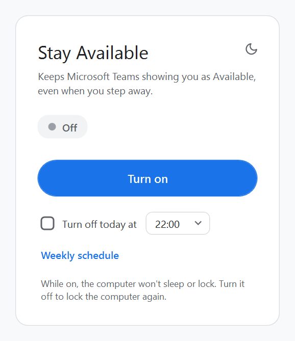
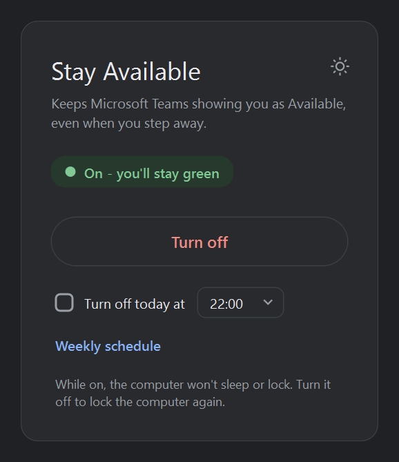
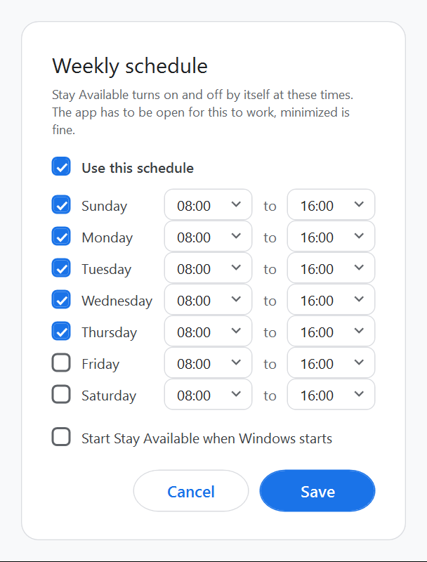

# Stay Available

A tiny Windows app that keeps Microsoft Teams showing you as Available (green), even when you step away from the computer.

Tested on Windows with Teams. If something doesn't work for you, please open an issue.

  
  
  

## How to use

1. Download `Stay-Available.bat` from the [latest release](../../releases/latest).
2. Double-click it. A small window opens.
3. Click **Turn on**. The status changes to "On - you'll stay green".
4. Click **Turn off**, or just close the window, to go back to normal.

The first time you run it, Windows may show a blue "Windows protected your PC" box. Click **More info** and then **Run anyway**.

## Leaving at a set time

Tick **Turn off today at** and pick a time. It turns on right away (if it wasn't already) and switches itself off at that time. This is just for today, and it wins over the weekly schedule, so you can use it to leave early or to stay later than usual.

## Weekly schedule

Click **Weekly schedule** to set your usual hours for each day, for example Sunday to Thursday, 08:00 to 16:00. Tick **Use this schedule** and Stay Available turns on and off by itself at those times.

If you turn it on or off by hand in the middle, that holds until the next start or end time in the schedule.

The app has to be open for the schedule to work, minimized is fine. Tick **Start Stay Available when Windows starts** so you don't have to remember to open it.

## Dark mode

Click the moon in the top corner to switch to dark mode, and the sun to switch back. The first time, it follows your Windows setting, and after that it remembers what you picked.

## What it does while it's on

- Presses F15 once a minute. Regular keyboards don't have an F15 key and apps ignore it, so it doesn't get in the way, but Windows counts it as activity, so Teams doesn't switch you to Away.
- Keeps the computer from going to sleep or turning off the screen.
- Stops the computer from locking, including Win+L and "Lock" in Ctrl+Alt+Del. Locking would turn Teams to Away no matter what, so it's blocked while the app is on.

When you turn it off or close the window, everything goes back to how it was, locking included.

## Good to know

- If Teams is also open on your phone and it goes to the background, your status can still turn to Away, since Teams goes by the device you used last.
- Closing a laptop lid usually puts it to sleep, and that isn't blocked.
- On a work computer, IT policies might override the lock blocking.
- If you end the app from Task Manager instead of closing it, locking stays blocked until you open the app again and close it.
- Settings are saved in `%APPDATA%\StayAvailable`.
- Using this on a work computer may go against your workplace's rules, so it's worth checking.

## Requirements

Windows 10 or 11. Nothing to install, it uses the PowerShell that comes with Windows.

## License

MIT
